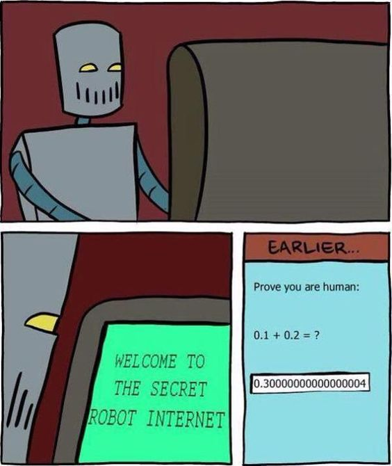

## Hi~，I'm Barry Zhu. 

I'm a passionate web developer from china 🇨🇳. My passion for software lies with dreaming up ideas and making them come true with elegant interfaces. I take great care in the experience, architecture, and code quality of the things I build. 

I am also an open-source enthusiast. I learned a lot from the open-source community and I love how collaboration and knowledge sharing happened through open-source. 

## Something about me

- 👨‍💻 I've became an indie hacker recently and keep working on a new product which helps people learn computer science fundamentals.
- ✌🏻 2025 Goals: Make my ideas come true.
- 📮 Reach me at: zhuyedev@gmail.com.

## Recent Activities

- 🎨 Complete the entire design of a UI component library on Figma, and develop it using `Headless UI` and `Tailwind CSS`.
- ⌨️ Complete the development of my portfolio website built with `Next.js`.
- 🔗 Learn about web3 and blockchain development.
- 🎸 Create a demo gallery to showcase my development projects.
- 📚 Translate some technical documents to help other domestic developers.
- 🐾 Relearn computer science fundamentals following the [CS-roadmap](https://github.com/zhuyedev/cs-roadmap).

## 🔧 Languages and tools

## My Gears

## Github Stats

